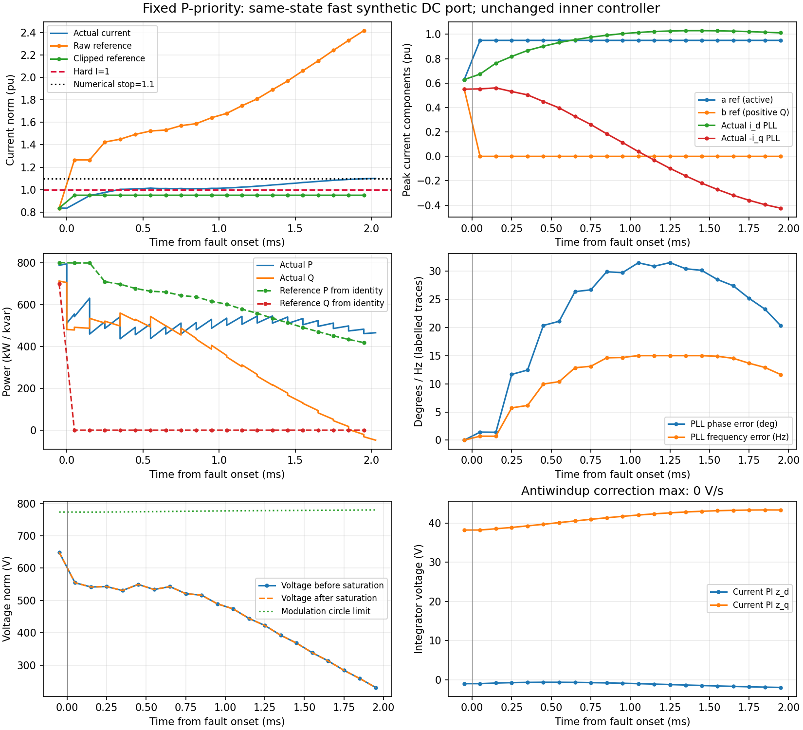

# G3：DC端口适用域与动态实际电流审计

2026-10-02 UTC。新增范围仅为预声明的源速度极小消融、四条标准分配基线及一个独立abc复核；未开发候选控制器、未作增益/阈值搜索。`paper_ready=false`。

## 结论

**现有模型只能称“合成受控DC端口”。在这个固定模型中，更快端口使原控制无关DC能量排除证书失活，但没有使所有被测控制器安全。** P优先先发生实际过流；Q优先仍发生DC上限触边；径向快端口避免DC触边并完成电气状态恢复，却已经违反实际连续电流界。没有全程硬安全的故障构造性见证，更没有P/Q联合服务成功。

原慢端口的必要能量界仍有效，适用对象是锁定源响应/硬爬坡及储能路径的控制集合。不能将其外推为一般BESS的物理极限。静态P/Q圆和参考电流裁剪也不能替代动态实际限流；这些标准基线的失败不是新方法创新证据。

## 1. DC拓扑和响应时间的适用性门

当前方程包含独立Pb指令、连续Pb状态、lag/ramp和固定效率，但没有电池OCV/端电压/阻抗、DC/DC电感电流、占空比或其内部储能。因此它既不是直连电池模型，也不是已验证的DC/DC闭环。只有经过另行方程/实验比对，才可把它作为特定DC/DC接口的缩约假设。

- [Zecchino等的720kVA/560kWh实验](https://arxiv.org/html/1910.04052v2)：50ms是Modbus刷新，1s是采集/上层PQ更新；电池端电压由等效电路约束，不能据此标定DC端20ms滞后或5MW/s硬爬坡
- [ABB PCS100 ESS手册rev.J](https://library.e.abb.com/public/8b613f6b51914388b996de018db1dd22/2UCD190000E001_j%20PCS100%20ESS%20User%20Manual.pdf)：p60的DC断路器/预充连接、p41的sub-cycle功率响应和p151的<1ms模拟接口属于不同层次，不能互相换算为DC/DC时间常数
- [SMA系统手册](https://files.sma.de/downloads/MVPS-S2-SCS-US-B8-SH-en-11.pdf)：p223/Fig.90把WGra置于外部有功参考路径，p248给0–100pu/s设置范围；p137明确DC电压控制模式不使用WGra/WGraRecon。这支持调度斜率与DC最快物理响应必须分开
- [Han等450kW DC/DC论文](https://doi.org/10.3390/electronics9101738)：内电流闭环近似对应0.6ms，但电阻替代电池的0→100A输出实验为26.8/8.2ms，不能把内环小信号、输出阶跃和铭牌容量混为同一数据

未找到与本算例功率、电压、拓扑和故障限流状态相匹配的utility BESS快速DC下降/反转数据。20/2/0.2ms与5/50/500MW/s都不是实机校准值。两种拓扑的不同状态方程、九条来源及页码见`protocol/phase_mechanism/dc_topology_scope.md`和`dc_topology_sources.json`。

## 2. 极小源速度消融

已冻结`protocol/GATE_A_SOURCE_SPEED_V1.json`。原端口τ=20ms、R=±5MW/s直接复用已重建重跑的原迹；唯一新端口为明确假设的τ=2ms、R=±50MW/s。额定功率、能量、电容、电流/调制界、控制律/增益、效率、完整0.6s初态、100μs时钟和一拍调制队列不变。改变端口速度是反事实模型比较，不是设备迁移或现实参数辨识。

同一完整初态分别运行快端口无故障配对参照和原0.4pu/150ms故障。快无故障过渡完成至2.75005s并守住所查硬界；未隐藏参数切换后的过渡。其实际P/Q保持波形本来就有绝对误差：全窗约13.471757kJ、11.562662kvar·s，因此“相对请求误差”和“相对无故障增量”必须分别计分。

用准确旧故障起点状态及同时遵守±1MW指令、lag和ramp的源包络：

| 端口 | 最大能量增加下界F+ | 可用总缓冲H+ | 排除裕度F+−H+ | 解释 |
|---|---:|---:|---:|---|
| 原20ms/5MW·s⁻¹ | 8870.613573J | 4341.250139J | +4529.363434J | 存在严格前缀矛盾 |
| 假设2ms/50MW·s⁻¹ | 887.061357J | 4341.250139J | −3454.188782J | 必要证书不再排除；非可行证明 |

单独加快τ而保持5MW/s时，上述硬爬坡主导的结果不变。50MW/s下仍需约16ms把初始约816kW源功率减到零。Q优先快速压低实际有功，而控制无关必要界乐观地授予所有电流用于480kW远端有功输出，二者不是同一策略。因此“证书失活但Q优先仍失败”不存在逻辑矛盾。新动态在0.6s改变参数，实际0.60005s起点已重新记录并重算证书，未把旧起点数值伪称为完全相同。

## 3. 四条标准分配对照，未改内环

冻结文件`protocol/GATE_A_ALLOCATION_BASELINES_V1.json`。P=800kW、Q=700kvar保持；Icap=.95Ibase。先用当前PCC电压得到a0=P/(1.5V)、b0=Q/(1.5V)：P优先先裁a，再按圆剩余半径裁b；径向按min(1,Icap/hypot(a0,b0))同时缩放。Iref=(a−jb)v/|v|，正Q对应负电压对齐iq。除分配块和policy参数外，其余控制函数文本与原版逐字一致，见`ALLOCATION_CHANGE_AUDIT.json`。

所有状态/队列均来自同一0.6s完整检查点；故障0.60005–0.75005s，最长观察至2.75005s。1.0pu为连续实际电流硬界，1.1pu只是数学停止阈值，未验证硬件保护。

| 端口/分配 | 实际I峰值 pu | Vdc峰值 pu | 终止/观察时刻 s | 全程硬安全 |
|---|---:|---:|---:|---|
| 原端口/Q优先（已有复验） | 1.000074650 | 1.100000000 | .605945970：DC触边 | 否 |
| 快端口/q_priority | 1.000077131 | 1.100000000 | 0.607238145：dc_high | 否 |
| 原端口/p_priority | 1.100000000 | 1.017429099 | 0.602073280：current_emergency | 否 |
| 原端口/radial | 1.030389564 | 1.100000000 | 0.611674775：dc_high | 否 |
| 快端口/p_priority | 1.100000000 | 1.016163426 | 0.602077287：current_emergency | 否 |
| 快端口/radial | 1.030394328 | 1.044498004 | 2.750050000：completed | 否 |

快端口Q优先：首次I=1在0.600399686s，DC于0.607238145s触边，即故障后7.188ms；5μs细化的I峰差约7×10⁻14pu、DC事件差<10⁻15s。原Q优先故障后5.896ms触边。不能把延期1.292ms解释成完整穿越或联合改善。

快端口径向裁剪完成记录，Vdc峰值1.044498pu；但I峰值1.030394pu，首次实际I=1在0.600357466s。其电气/控制状态于1.30s满足同时间无故障目标和50ms自周期联合判据，属于已有违规后的归轨观察，不能改写为安全恢复。

原端口没有虚假全程通过；两个新增慢端口基线分别在实际过流或DC触边终止，符合已证明负控制的必要结论。

## 4. P/Q服务积分、记录窗口与库存

新轨迹通过被动积分直接保存∫|P−P_req|dt、∫|Q−Q_req|dt、带符号P/Q积分和电池库存，不把后续多供能抵消过去瞬时缺口。下表只列实际观察到的故障前缀；停止早的行没有完整150ms成本，**不能据较小数值排名**。

| 端口/分配 | 已观察故障时长 ms | ∫绝对P误差 kJ | ∫绝对Q误差 kvar·s |
|---|---:|---:|---:|
| 快端口/q_priority | 7.188145 | 5.424840 | 1.877282 |
| 原端口/p_priority | 2.023280 | 0.598531 | 0.772882 |
| 原端口/radial | 11.624775 | 4.657490 | 4.610913 |
| 快端口/p_priority | 2.027287 | 0.599964 | 0.775929 |
| 快端口/radial | 150.000000 | 61.022256 | 54.442379 |

已有慢Q优先原迹未记录完全相同的绝对误差被动积分，不伪造同精度数值加入排名；其P/Q原始密集轨迹仍保留。

快径向完整150ms故障内仅实际提供约58.977744kJ有功积分和50.557621kvar·s无功积分，对应请求120kJ和105kvar·s。全观察窗相对同快端口无故障参照少提供59.969631kJ有功、50.452514kvar·s无功，电池库存多61.251820kJ。正库存差不是补偿过去服务，后续能量再平衡没有研究。

非控制时钟终止点的配对参照由保存的完整无故障状态重算不足100μs局部区间，不重建整条轨迹；回算至下一个已保存端点的最大SI状态差2.27×10⁻13。所有原始JSON/NPZ保留，正式服务/恢复总评见`source_speed_ablation/results/AUTHORITATIVE_RESULTS.json`。

## 5. 实际过流的独立abc与同窗核验

严格P优先快端口选为唯一独立复核条件。abc独立三相电路积分，仅改变其原sample中的分配顺序；运行未导入dq RHS、控制器或allocator。用共同检查点作无损坐标转换，完整归一化初态差2.22×10⁻16。

- abc实际I=1根：0.6003908116664826s；dq：0.6003908116664819s
- abc1.1数值停止：0.6020772872134779s；与dq差4.66×10⁻15s
- abc10/5μs停止变化约−2.55×10⁻15s；abc/dq采样前完整状态最大归一化差2.84×10⁻13
- Iref始终≤.95pu；采样PCC最低.36664058pu，未激活.1pu低压归一化分支；800kW请求也未激活950kW预裁剪差别
- 电压从未饱和，电流PI电压反饱和项为零。PLL于.6011s触75Hz，但晚于首次I=1；不单凭这个时序认定唯一因果

原始/限幅后参考、实际电流、PLL误差、限幅前后电压、PI积分器及反饱和项均有同窗CSV/NPZ。dq离线诊断重算与已记录参考/饱和量最大差2.22×10⁻16。详情：`model_audit/p_priority_abc/REPORT_ZH.md`、`COMPARISON.json`、`VALIDATION.json`、`MANIFEST.json`。

该结果支持同一平均值模型的独立数值复核，不等于硬件电流保护、开关模型、实机DC/DC或完整故障穿越验证。非电流/DC事件约束的“峰值”主要来自积分节点；不得升级为严格连续区间极值证明。

## 6. 机制和下一门的限制

常规DC源滞后与上下能量余量就能产生偏峰。当前分支局部解析代理的临界电压提升仅约.000278/.000167pu，等效14.68/11.29J，不能作为主贡献；现有周期MPC/可行集、动态P/Q能力及GFL DC–PLL恢复已有直接碰撞。详见`protocol/phase_mechanism/literature_collision.md`、`theory_proposal.md`。

更有信息的待检验对象是上下状态条件排除区与构造性恢复集合之间的缺口；当前没有该完整充分证书。高功率慢波形的额定筛查候选800kW/.5Hz只是后续提案，未运行新幅频轨迹。不能靠缩电容、提高倍率或挑有利相位维持危害。

在比较新P/Q方法前，必须先选择已有动态实际电流限制或预测安全滤波，并验证其适配100μs采样、一拍队列、拍间故障和Vdc相关实际调制电压。当前标准优先级失败主要暴露内层安全缺口；任何新方法不能只击败这些静态基线。原慢端口的能量不可能界必须保留，动态限流层不能凭空消除它。具体下一门以独立方法提案为准，尚未实现或运行新安全控制器。

任何新非正弦服务模板先过无故障安全/损耗补偿轨道门。已有证据只能支持结构启发的合成阶段波形；GPU遥测、PSU滞后和设施PCC不可混同。未来策略只读当前测量与因果历史，不获未来跌落/清除、文件未来样本或干净阶段标签。相同电气输入/负荷律的工业重标签必须同响应。见`protocol/phase_mechanism/exogenous_waveform_scope.md`。

## 7. 交付与状态

本阶段代码、预声明协议、原始轨迹、只读诊断和独立审计均保留；没有重启G1/G2。此前Stage0/重建重跑/12条件扩展的文件保持原证据身份。新端口与优先级实验明确标为新诊断，不冒称旧文件恢复。

当前状态：完成本轮被批准的极小诊断；未建立物理适用的普遍BESS边界、未获得全程硬安全故障见证、未验证候选策略优势。`paper_ready=false`。
