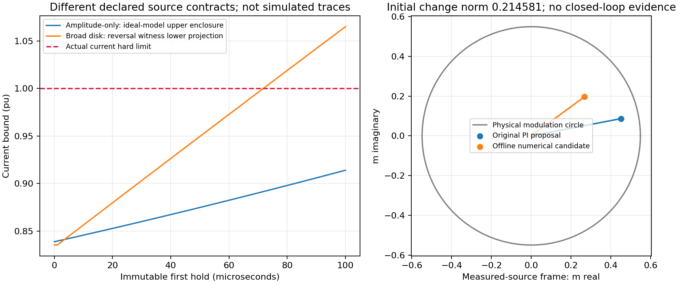

# G3 MPSC 门0：固定程序的证书与接口诊断

日期：2026-10-02 UTC。仅解析集合构造、不可更改首保持段、一次离线初态优化和独立只读审计；未实现或执行六个闭环模型门。`current_guard_qualified=false`，`paper_ready=false`。

## 结论分层

1. 全相位电压圆包含未在原幅值跌落中声明的180°突跳。旧完整队列状态对该宽合同不可准入：在更新后1μs反相，首100μs末端电流投影下界为1.065060034pu，新命令尚不能改变这一保持段。这不是对平衡幅值跌落合同的不可行结论。
2. 对明确收窄并另行推导的结构化合同，当前测量确定初相、频率固定60Hz、无相角跳跃、幅值可在任意未知时刻于0.4–1.0pu间变化。首段动态Vdc外界约[1407.876055,1417.597690]V；方向包络加1μs节点间导数padding给电流上界0.914045145pu，联合首退出论证闭合。
3. 闭式deadbeat反馈的Ω在两个合同下均为理想实数模型的RPI。状态/输入收紧与终端非空性又单独核对：结构化终端调制上界0.510711054，小于0.548482756；终端连续电流外界约0.173048428pu。
4. 固定N=10、单次SLSQP为结构化初态给出离线数值可行候选，最大primal残差5.55e−17。**首命令改动0.214580692很大，发生于健康初始化时。** 它不能称为透明接入、可部署强基线或健康服务保持；没有为减少干预调N/K/包络。
5. 外向舍入、全装置联合DC/SoC不变性及闭环/实时性仍未完成。这里是条件电流/调制数学构造及数值候选，不是全装置认证。

## 1. 冻结程序与信息

`protocol/GATE0_MPSC_DESIGN_V1.json`固定N=10、Ts=100μs、解析K/Ω/终端构造、五个保持段节点、弦误差界、数值保留1e−8pu、SLSQP500次迭代上限、ftol1e−12和唯一最小范数终端等式初猜。没有重启优化、搜索N/K或挑选轨迹。

只取已有独立abc文件的第一条初始化测量及同一次原PI输出，用当前PCC功率、电流、Vdc和旧applied调制恢复电压及远端相量。读取的不是source_pu、未来行、事件对象或清除时间。独立审计从原Q优先checkpoint和当前电气测量重算m_nom，与使用的首行差6.94e−17；当时参考仅.835358pu，P/Q优先级尚未限幅，故没有偷换分配信息。

测量模型为本合成台架的无噪声观测，不是商业P/Q接口开放内部队列的声明，也未证明真实传感器/参数误差鲁棒性。重构源相量约563.382640840V，初相约−3.7e−14rad；后续60Hz旋转是明确的物理合同，不读取未来波形。

## 2. 旋转、仿射项与终端轨道

令电流按峰值Ibase归一化，q为即将保持的归一化调制，使用初相由测量获得且按60Hz旋转的同步坐标。令Rθ=Rot(−ωTs)、a=exp(−Rtot Ts/Ltot)、b=(1−a)/Rtot、c=1400b/Ibase：

    A = [[aRθ, cRθ], [0,0]],  B = [[0],[Rθ]]
    K = [−a²/c I₂, −a I₂]
    Acl=A+BK,   Acl²=0

固定数值a=.9969901096078266、c=.3749076127863502；K电流块−2.6512912641821282、队列块−.9969901096078266。

保持段内0.7pu中心源仍旋转，精确积分为

    J(s)=[exp(jωs)−exp(−Rtot s/Ltot)]/[Rtot+jωLtot]
    d=[−Rθ Ecenter J(Ts)/Ibase; 0]

所以非零源中心不能作为静态零输入平衡。终端名义点是

    i_bar=0
    q_bar=Ecenter J(Ts)/(1400b)
    m_bar=Rot(+ωTs)q_bar

q_bar是本拍保持量，m_bar是下一拍才可用的新命令，二者不能相等。备份为m=m_bar+K(s−s_bar)。在静止αβ中，这些中心随测得相位旋转；固定60Hz/100μs下500拍=50ms=3电周期后返回同相。这里通过精确同步变换得到固定终端点，不另做500拍终端优化；该周期等价只在所声明频率/无相角跳跃范围成立。

## 3. Ω成立与约束兼容性分开检查

电流扰动圆半径

    r=b(280*mmax+E_uncertainty)/Ibase

用全物理Vdc范围[1120,1540]V与中心1400V，因此280V是终端/全局包含的保守差界，**不是首100μs动态Vdc变化**。队列扰动在理想数学模型为零。定义Ω=W⊕AclW；任意误差可写

    e_i=w0+aRθw1,  e_q=RθKi w1,  |w0|,|w1|≤r

故电流投影半径(1+a)r，队列及KΩ输入投影半径|Ki|r。对保持段，误差传播半径加新扰动后恒为(1+a)r；此恒等式由a(s)、b(s)及Ki闭式关系推导，不以随机支持方向代替证明。

| 项 | 宽全圆 | 结构化幅值 |
|---|---:|---:|
| r | .191994958523 | .086386738042 |
| Ω电流半径 | .383412033265 | .172513461470 |
| KΩ输入半径 | .509034556299 | .229036403911 |
| 收紧名义输入半径 | .039448199431 | .319446351819 |
| 终端调制外界（含数值保留） | .509034566299 | .510711053544 |
| 终端连续电流外界 | .383412464125 | .173048427728 |

两组终端集合条件非空，不推出当前初态可准入。宽合同已有首段反例；其SLSQP失败且产物残差很大，该产物明确未认证并丢弃。拒绝宽合同的依据是独立不可控首段反例，不是数值求解失败。

名义电流在{0,25,50,75,100}μs节点处约束，并用无条件名义轨迹外界构造二阶导数M2。结构化M2约467886.420215pu/s²，弦误差约3.66e−5pu；避免先假定名义电流在收紧范围再证明它在该范围的循环论证。实际电流误差管与弦误差、数值保留分别相加。

## 4. 首段动态Vdc与因果包络

旧queued在首段不可更改，实际电压为Vdc(t)q，不能将其当作采样伏特值保持。在电流/电压允许域的首次退出之前，以已知Pb和同拍源指令、精确lag/ramp标量解给母线输入范围，再用逆变器功率与损耗上/下界积分W。两端口首100μs都无法先触DC界。结构化源的短旋转相位扇区用分量外包，Vdc沿q方向用线段外包；1μs网格只用于计算外界函数，另加可核验导数padding覆盖节点之间。

反相见证仅属于宽全相位圆；其电流投影下界不是实际仿真轨迹，也没有新闭环积分。首段测试与以后每一步MPSC递归可行、终端、服务质量不是同一问题。

## 5. 离线初态计划及残差

结构化程序：单次SLSQP9迭代；终端等式残差5.55e−17，最大范数约束超量0。独立重算Ω见证等式、逐拍仿射动力学、全部节点约束与首输入，残差最大1.67e−16。

    原PI新调制  [0.452252295597, 0.086812242414]
    离线候选    [0.267983805980, 0.196766765816]
    差范数      0.214580692240

后验凸QCQP的数值KKT核对：stationarity∞约4.95e−14，非负乘子成立，互补残差0。它是数值最优性一致性检查，不是经过区间运算验证的最优性证明。大幅健康干预完整保留，不能仅凭初态可行就进入服务性能比较。

终端等式微差可在理想实数下通过最后两个名义输入的线性尾部修正消除：最大修正约1.48e−16，首命令不变，受影响约束最小原余量.03777。原存储计划未被覆盖，双精度重算等式仍约5.55e−17。此论证不等于所有浮点误差已被严格包围；没有投影物理电流或重置设备状态。

本机每个合同的离线总诊断用时包含矩阵/集合构造和优化，结构化约9.49ms。它不是目标控制平台的最坏求解时间，也显著不是100μs部署验证；不据此声称实时可用。

## 6. 备份含义和未闭合项

已获得的是当前/调制的条件数学备份：电压合同和Vdc域必须成立。源Pb、DC库存、SoC及PI/PLL恢复不在Ω不变性状态里。原慢源能量矛盾仍不能被该电流层消除；终端i_bar=0也不等于维持800kW/700kvar服务。

仍未闭合：

- exp/旋转/矩阵/优化输出的机器外向舍入证书与严格浮点实现保证；1e−8数值保留目前是明确记录的数值保留，不是已证明包住全部误差
- 包含DC/SoC/AC功率及恢复的联合递归可行集
- 新guard实际接入、故障期间的预测管包含、计划移位/失败备份实现及抗饱和一致性
- 健康服务透明性；0.21458初始改动可能造成显著P/Q/库存代价，必须先做匹配无故障门
- 100μs目标平台最坏计算时间、超时、测量噪声和非固定频率/相角跳跃扩展

这些不阻断当前解析/离线诊断的记录，但阻断“全装置认证”“真实部署”或“新分配方法已优越”的主张。六个闭环模型门仍需单独批准。

## 7. 文件入口

- `current_guard_gate0/GATE0_RESULTS.json`：两个合同、首段、集合、计划与失败产物
- `current_guard_gate0/PRIMAL_POSTCHECK.json`：原计划KKT和尾部微差后验
- `current_guard_gate0/INDEPENDENT_MATH_REVIEW.md`：独立解析/实现审计
- `current_guard_gate0/diagnose_gate0.py`、`check_primal_witness.py`：可复核程序，无闭环模型执行
- `protocol/GATE0_MPSC_DESIGN_V1.json`：结果前固定的程序与停止规则
- `protocol/GATE1_MPSC_SIX_MODELS_V1.json`：仅为下一步待批准执行清单，不代表已运行

`paper_ready=false`。资料为自行编写的方程、代码、结果和引用链接；无下载论文/厂家PDF原件或第三方代码副本。

该wall time仅代表当前SLSQP固定冷启动的可复核离线实现，不能判定成熟MPSC或专用QP/SOCP实现达不到100μs。若未来比较计算优势，需要另设经过合理warm start、缓存和专用求解器优化的同信息基线；本轮不为测速改变冻结程序。
