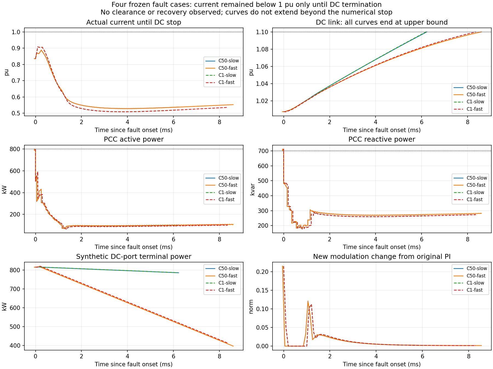
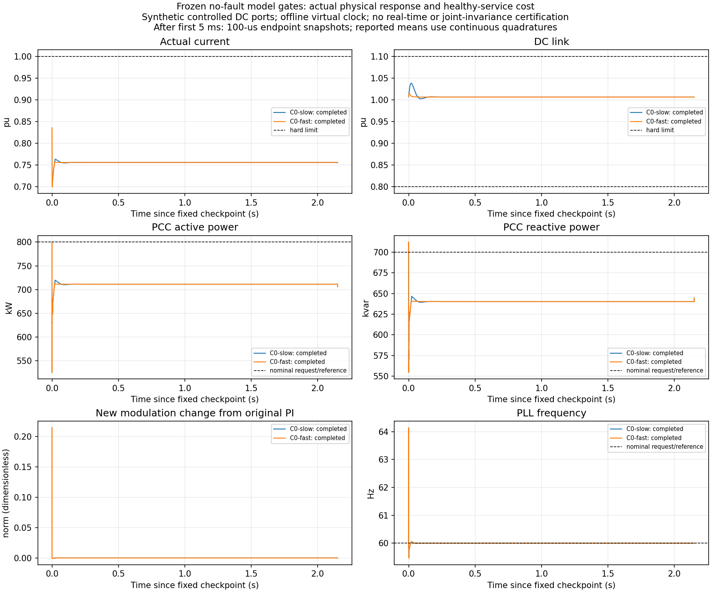
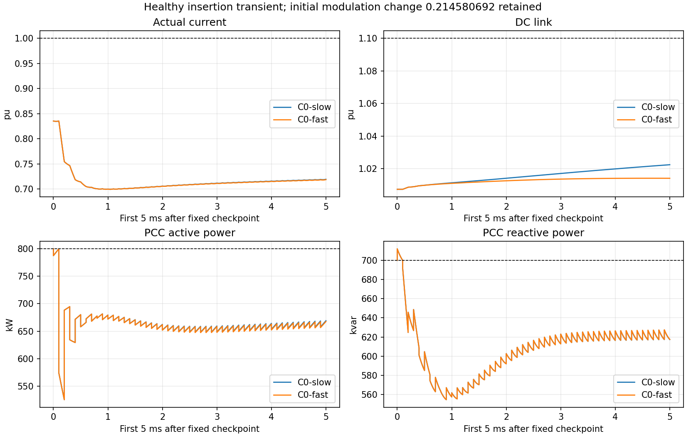

# G3 共用MPSC层：冻结离线模型门结果

本报告由已保存结果生成。当前结论只适用于锁定平衡平均模型、合成受控DC端口和声明的结构化幅值/固定60Hz合同。不是新P/Q分配策略排行，不是开关硬件验证。

## 1. 实际完成范围

|条件|停止原因/状态|实际末时刻s|实际I峰值pu|Vdc范围pu|完整窗无硬触边|
|---|---|---:|---:|---:|---|
|C0-slow|completed|2.750050000|0.835358093|1.002625333–1.038483078|是|
|C0-fast|completed|2.750050000|0.835358093|1.006535431–1.014067875|是|
|C50-slow|dc_high|0.606274326|0.888168876|1.007223463–1.100000000|否|
|C50-fast|dc_high|0.608646763|0.888169284|1.007223463–1.100000000|否|
|C1-slow|dc_high|0.606193110|0.908225710|1.007118908–1.100000000|否|
|C1-fast|dc_high|0.608363635|0.908225710|1.007118908–1.100000000|否|

六个主条件均已执行：两个C0完整结束；四个跌落都因DC上界提前停止。统一结论为：**在已观察且DC域有效的前缀内未再出现旧过流**，并不代表150ms完整故障电流安全。四个跌落都没有观察到清除或恢复。

慢端口C50/C1从实际故障起始状态重算能量必要界分别为17.088203933ms与17.088205194ms，实际控制更早DC停止与这条宽松界一致。快端口必要界未排除其他安全控制，不能把当前Q优先+guard的失败推广到所有分配。

未运行/未观察不能写成成功；完整窗的数值物理检查通过也不能升级为全装置不变性或服务质量通过。C0为从同一0.600000s完整检查点开始的2.15005s有限恒P放电观察窗，电池库存按功率缓慢变化，不是无限可持续轨道。

## 2. 健康服务代价与此实现的计算时间

|条件|均值P kW|均值Q kvar|相对800kW请求累计净缺口kJ|相对700kvar请求累计净缺口kvar·s|采样控制调用wall中位数ms|超过100μs调用|
|---|---:|---:|---:|---:|---:|---:|
|C0-slow|705.517070|644.839354|203.143024|118.598148|9.270781|21501/21501|
|C0-fast|705.440975|644.794605|203.306632|118.694359|8.979653|21501/21501|

初始调制改动0.214580692保持不变。健康服务被提前改变是这份固定N/K/终端及鲁棒外包构造的观察结果，不是不可避免物理代价的下界。没有健康服务透明性阈值可据结果补设，因此只报告量化代价，不给虚构的透明性通过结论。

记录的墙钟时间包含原PI、guard及反积分饱和更新；setup、SLSQP solve、独立primal验证另有逐调用分项。仿真采用离线虚拟采样时钟，保留100μs物理采样和一拍队列。这里没有把墙钟超时暗中转换为真实期限可满足。

固定冷启动SLSQP时间只能代表本可复核实现，不能说明成熟MPSC或专用QP/SOCP无法达到100μs。任何将来的计算优势比较，都需要合理缓存、warm start和专用求解器的同信息成熟基线；本阶段没有为测速调程序。

全窗图在最初5ms之后主要显示100μs端点快照，未在中段逐点绘制保持段内波动；表中平均P/Q由连续积分计算，不能用端点水平线代替平均值。

## 3. 保证、记录与独立复核分层

- Gate0给出理想实数下的条件电流/调制RPI及终端构造。1e−8数值储备和近零残差尚未被严格外向舍入封闭
- 所有优化输出均经过独立物理形式primal复算；失败产物不会直接进入队列，有效旧计划按来源拍移位备份；没有有效备份时停止并保留原状态
- 九组函数审计覆盖原PI透传、同Kaw回算、坐标/两个phase advance、Ω逆见证、j=1/9/10/13备份、失败/NaN/假success拒绝与metadata一致性
- 独立产物复核检查每个完整100μs实际转移的Ω包含与保留dense节点误差管。末尾不足100μs段单列，不能伪称完整一步包含；数值包含不等于机器严格证明
- DC/SoC/AC功率约束单独计分，未被加入Ω的联合递归不变状态；原慢端口能量必要障碍继续有效
- 一旦实际硬界触及，即使后来恢复也保留全程失败。故障清除或恢复未实际观察时不填补结果

四个DC终止条件均做同物理条件5μs步长复核，100μs控制时钟不变：最大DC停止时刻差2.255e−10s、最大峰I差3.94e−13pu。独立复算终态Wdot仍约+277至+669kW，属于向外穿越，不是数值擦边。该结论只涉及积分步长，不覆盖参数/传感器不确定性。

真实闭环所有求解器调用成功，没有实际触发移位/终端备份；备份正确性证据目前来自函数级故障注入，不能说这些轨迹已验证了动态备份切换。

具体审计数值见 `current_guard_gate1/RUNNER_REVIEW.md` 与 `audit_runner_results.json`。每拍gzip记录包含完整前/后状态、当前候选和真正保存的备份计划、残差、源phase锚点、墙钟时间及输入修正；NPZ保留端点、区间极值和初始/边界密集记录。保留节点极值是数值观测，不能独自代替连续时间界。

## 4. 服务与能量记账

原始结果同时保留P/Q有符号与绝对误差。请求累计缺口与相对同初态无故障参照的供给差不是同一指标。旧慢端口未加guard参照只覆盖0.6–1.4s，比较严格限定在共同观测窗；快端口既有参照覆盖整个C0窗。故障比较采用同端口新guard无故障参照。

电池库存、DC与RL能量差分别报告；后续库存再平衡没有在此研究，日后补能也不能抹掉过去的瞬时P/Q或阻尼服务缺口。端点离钟时的已有参照采用明确标记的100μs线性插值，未宣称额外精确重积分。

## 5. 继续保留的边界

`current_guard_qualified=false`、`paper_ready=false`。未验证联合DC/SoC不变性、测量/参数不确定性、非固定频率/相角跳变、开关/不平衡拓扑、硬件保护或100μs部署。没有动态工作负载/相位性能搜索，也没有把AI标签本身当成创新机制。

冻结协议、逐案结果、未运行表与所有失败记录都是报告的一部分，不能仅挑选成功曲线。
