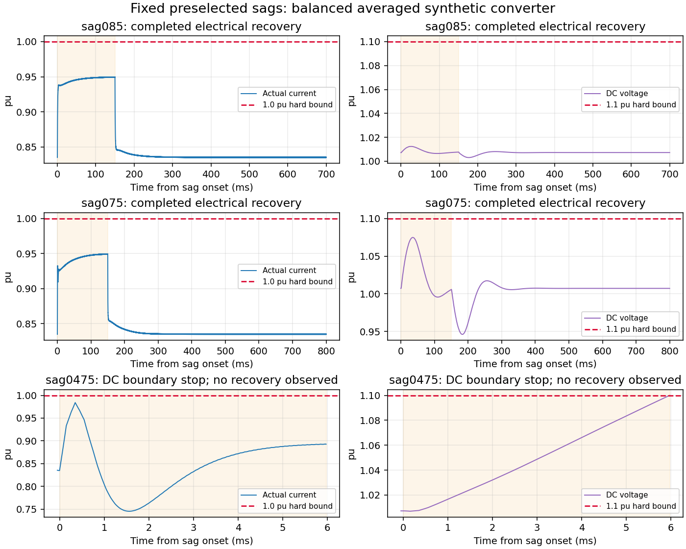
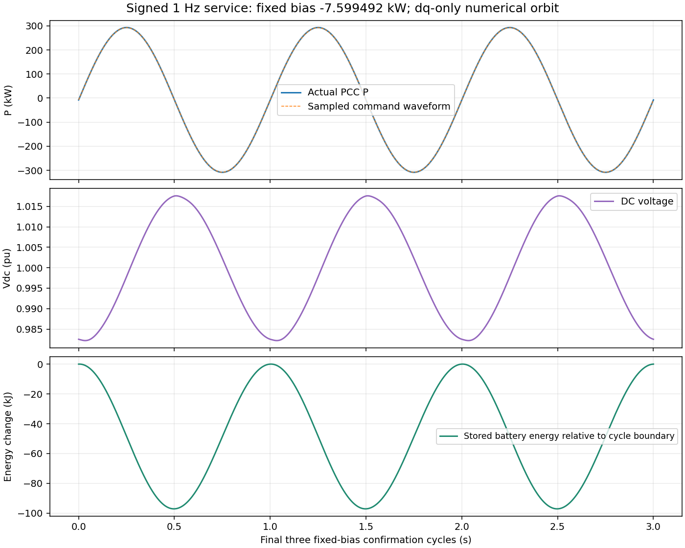

# G3 Gate A 扩展：四象限、浅跌落恢复与有符号周期轨道

日期：2026-10-02 UTC。此阶段为新实验；此前代码/参数重建与重跑资料原样保留。

## 结论

**12个预先冻结的模型诊断已完成，paper_ready=false。** 四象限稳态及4个向外小阶跃均守住所检硬界；0.85/0.75 pu、150 ms跌落完成电气控制状态恢复；0.475 pu在DC上限触边终止。持续1 Hz有符号基准经损耗偏置校准后，在固定偏置下观测到3个完整、近似重复的周期。没有新策略比较、性能搜索、实际硬件验证或可行域充分证明。

这里的“恢复”指电流、DC-link、源功率、PLL、PI积分器及采样/延迟队列回到电气服务轨道，同时限幅退出。电池库存与累计能量积分被保存和记账，但不要求恒定正P时回到原值；**电气控制状态恢复不等于电池能量恢复，也不等于故障期间无服务缺口。**

## 1. 冻结范围与物理模型

冻结文件：`protocol/GATE_A_EXTENSION_V1.json`，SHA256 `a1c399415c6a4b8d17ccf6193963ed73b712fca0890856fbbbf9dcfe1af6bdb8`。

资源与控制律完全沿用已复验V2.1：1.2 MVA、690 V、2 MWh、端口±1 MW、交流有功±0.95 MW；实际相电流峰值基准1419.994 A、连续1.0 pu，参考电流限0.95 pu；Vdc初值1400 V、C=22.040816 mF、允许0.8–1.1 pu；电池源20 ms滞后、±5 MW/s；100 μs控制时钟和一拍归一化调制延迟。GFL/PLL、动态RL、真实DC能量和损耗保留，无状态电流投影，无制动支路。新增状态仅为被动P/Q/电池功率积分，不参与反馈。

四象限分别(P,Q)=(±300 kW,±200 kvar)，小阶跃固定为同号向外至(±350 kW,±225 kvar)。从首个安全收敛完整检查点开始阶跃，偏移50 μs。固定功率的电气状态检查排除库存趋势，真实SoC仍逐步变化并受硬界约束。

## 2. 必要界预选，不能倒置为可行性证明

三跌落均从既有0.600000 s完整检查点出发，在0.600050 s施加，计划150 ms。采用远端源与串联RL总能量守恒，不用候选实际PCC电压反推普适界。设ρ为远端保留电压、B_loss=31140.4463 W、η=0.99、R_down=5 MW/s，则前163.128 ms内：

`Fρ(t)=(η Pb0−ρ Sbase−B_loss)t−0.5 η R_down t²`

所有守住实际I和DC界的控制都须满足每个前缀Fρ(t)≤H；H=4341.250139 J含DC和可用电感缓冲。最大前缀是clip((ηPb0−ρSbase−B_loss)/(ηR_down),0,T)。0.85和0.75的该必要过压界不活跃；近界采用ceil(1000ρ_c)/1000，ρ_c=0.47419213725，故选0.475。其最强前缀在41.6854 ms，距严格能量矛盾尚差40.506248 J，外向舍入版本仍不排除。

这40.506 J仅是固定参数解析模型的必要界余量，没有参数/硬件误差鲁棒保证。它既非可行充分证书，也不保证当前Q优先控制器通过。此前0.4 pu的20 ms前缀严格矛盾及17.088204 ms交点仍保留为已审计负控制；不得恢复旧17.035 ms数值。

## 3. 固定条件结果

| 条件 | I峰值 pu | Vdc范围 pu | 首个电气检查点/共同恢复时刻 s | 结果 |
|---|---:|---:|---:|---|
| steady_pp | 0.410971561 | 0.998664505–1.004529800 | 0.600000 | 完成并守界 |
| steady_pn | 0.305153170 | 0.997226939–1.000320564 | 0.600000 | 完成并守界 |
| steady_np | 0.409769941 | 0.999771468–1.003210032 | 0.600000 | 完成并守界 |
| steady_nn | 0.307032452 | 0.998408524–1.000963377 | 0.600000 | 完成并守界 |
| step_pp | 0.340886701 | 0.988994715–1.004417627 | 1.200000 | 完成并守界 |
| step_pn | 0.353909444 | 0.985155403–1.000428211 | 1.200000 | 完成并守界 |
| step_np | 0.343344393 | 0.999927885–1.014594910 | 1.200000 | 完成并守界 |
| step_nn | 0.357304293 | 0.996003955–1.010926780 | 1.200000 | 完成并守界 |
| sag085 | 0.949707635 | 1.003082253–1.012410284 | 1.300000 | 完成并守界 |
| sag075 | 0.949491042 | 0.946192973–1.074859301 | 1.400000 | 完成并守界 |
| sag0475 | 0.984102355 | 1.006978113–1.100000000 | — | DC触边，未观察到清除/恢复 |
| signed_periodic | 0.257581637 | 0.979748185–1.017608151 | 10.600000 | 完成并守界 |

稳态4例首个合格检查点均0.6 s；阶跃4例在1.2 s完成新电气状态收敛，即阶跃后599.95 ms。对跌落，正式共同保守判据同时要求回到故障前归一化目标和50 ms自周期差≤1e−5，三次连续检查，以及过去150 ms硬界安全、PLL频差≤1 mHz、参考电流/调制/源指令/PLL频率限幅退出。

0.85 pu正式恢复为1.30 s，即清除后549.95 ms；0.75 pu为1.40 s，即清除后649.95 ms。较窄target-only指标分别为1.20/1.35 s，单独保留，未替代正式指标。abc原摘要只使用target-only；其实际原轨迹运行到2.75005 s，重新对同一轨迹按共同判据计分得到1.30 s，无外推或dq替代。

0.475 pu在0.6060234821815205 s触及DC上限，故障后5.9734821815 ms；实际I峰值0.984102355 pu，没有先触发连续电流界。10/5 μs dq终止时间差约3e−16 s；独立abc同事件差≤1.94e−14 s。到触边前未数值超界，不能称完整测试通过；后续清除、限幅退出、恢复都未观察。

## 4. 独立复核与报告纠正

abc采用独立三相物理状态和RK4，保持相同物理假设与控制律，核对0.85、0.475两点，后者另作5 μs细化。I峰值差≤1.22e−13 pu，Vdc极值差≤4.55e−13 pu。24个非积分代数点覆盖Pb负/零/正、Q双符号和两坐标角，电流微分变换误差≤4.99e−10 A/s，总储能功率残差≤1.17e−10 W。它们不是PWM/开关或现场校准。

原始实验JSON/NPZ均保留。独立审计发现并通过后处理统一补齐：①原hard-safe布尔缺少调制范数检查，现检查初始applied/queued、全程保持向量和全部新命令；②首次DC/SoC/紧急电流触边单列，区分边界上停止和完整通过；③初始检查点采样前左极限纳入P/S极值；④仅观察到真实active→inactive才报告限幅退出，0.475不得用“最后活跃+一拍”假填退出。所有共同阈值不变，未修改物理控制器。

正式评分入口为`gate_a_extension/results/AUDITED_RESULTS.json`和`model_audit/gate_a_extension/authoritative_summary.json`。0.85参考电流限制最后活跃0.7500 s，0.7501 s观察到退出；其他正式限制器未激活。独立abc的全局绝对电池能量累计会有约0.01551 J浮点差，因此数值超小漂移不得解读为实物精度。

## 5. 相同初态无故障参照下的能量记账

另做一份共用无故障配对参照，保持相同完整0.6 s初态和800/700请求，仅在已定三跌落的终止/恢复时刻比较。它不增加新的扰动条件。v1保留基础库存/远端源积分；v2加入PCC有功和无功被动积分，二者均保存。以下差定义为“扰动轨迹−同初态无故障轨迹”。

| 条件/比较时刻 | 电池库存差 kJ | PCC累计有功供给差 kJ | 远端累计有功差 kJ | DC储能差 kJ |
|---|---:|---:|---:|---:|
| sag085 / 1.300000000 s | +2.743446 | -3.210277 | -3.574186 | +0.000001 |
| sag075 / 1.400000000 s | +26.101480 | -25.866358 | -26.226365 | -0.000001 |
| sag0475 / 0.606023482 s | +0.078968 | -4.324277 | -4.341981 | +4.220974 |

0.85/0.75的电池差为库存盈余，并非已恢复或需要回填的电池亏空；供给差和损耗差使二者不相等。0.475仍有约4.221 kJ DC额外能量且未恢复。过去的瞬时P/Q跟踪或阻尼缺口不能用未来补电抹除；后续库存再平衡未研究。所有比较还报告电感能量差与总损耗差，整体配对储能守恒残差见配对JSON。

## 6. 有符号持续周期基准

预先固定P_req=300 kW·sin(2π·1 Hz·(t−t_start))+b、Q_req=0。先用同规则获得b=0的安全0.6 s检查点，随后以相位0启动。每完整周期仅使用已经发生的储能差ΔEb=−∫P_deplete dt，令下一周期b=clip(b+ΔEb/T,−50 kW,0)。最多12个校准周期；达到条件后冻结b，最多8个后续周期中要求3个连续完整合格周期，不重置任何物理/控制状态。

实际第7个校准周期后固定b=-7.599491858 kW，在第8–10周期确认，仿真结束10.6 s。固定偏置后完整周期状态最大差=3.481e-11；电池储能每周期积分漂移最大=3.554e-08 J，相比预注册1 J阈值充分小。该结果只支持观测到近似周期数值轨道，不构成无限时不变性证明。

最后周期实际PCC平均P=-7.641134995 kW，平均Q=-0.623666540 kvar，电池端口平均P=-3.923443410 kW。后者不需要为零，因为充放电效率分支不同。指令偏置与实际P均值不同，不能把请求轨道当成精确实际输出。均值由连续动力学被动积分得到；100 μs固定相位端点可能混叠拍内P/Q纹波，不能用端点Q极值围住连续时间Q均值。所有硬界用内部积分点极值和事件检测，不只查控制时钟端点。

最后周期100 μs端点观测的电池储能摆幅约97.095312 kJ（26.970920 Wh），SoC摆幅1.348546e-05；实际I峰值0.257581637 pu，Vdc为0.982192000–1.017578178 pu。SoC储备远未耗尽，不能据此包装SoC边界优势。

**因果可用性限制：**校准依赖准确的内部仿真储能积分和已知周期时钟；真实BMS/SoC观测分辨率、噪声、能量估计器和现场可部署性均未验证。1 J门槛是数值模型检查门槛。本周期只由dq积分验证，独立abc符号代数核验不能替代周期轨迹验证。

## 7. 保存与可复现范围

所有12个原定条件的100 μs完整状态/控制记录、每控制区间内部步极值、首次触边、完整检查点、损耗/库存、未完成终止均保留。三跌落的dq 10 μs内部原轨迹、近界dq 5 μs及独立abc 10/5 μs原轨迹保留；普通低风险例未重复保存5 μs密集轨迹。周期全7+3周期校准/确认记录、偏置历史、最终forcing clock/bias完整检查点均保留。

主要新文件：

- `GATE_A_EXTENSION_SUMMARY.json`：机器可读总体结果与逐文件数值验证
- `gate_a_extension/run_dq.py`：本轮执行版本，物理/控制函数导入旧锁定实现
- `gate_a_extension/score_audited.py`：只读后评分澄清，原始JSON未覆盖
- `gate_a_extension/results/PAIRED_ENERGY_ACCOUNTING_AUDITED.json`：同初态配对库存及PCC积分
- `gate_a_extension/results/signed_periodic_complete_final_checkpoint.json`：含最终偏置、时钟和相位的检查点
- `protocol/GATE_A_EXTENSION_IMPLEMENTATION_AUDIT.md`：独立只读实现/计分审计
- `model_audit/gate_a_extension/`：独立abc脚本、原始数据、评分和manifest
- `DELIVERY_MANIFEST_GATE_A_EXTENSION.json`：综合包完整hash清单；旧`DELIVERY_MANIFEST.json`仍保留原阶段身份

必要依赖仍为已记录的Python/NumPy/SciPy；绘图用已安装Matplotlib。没有新增外部代码安装。公开motulator wheel仍不打包，官方来源/版本/hash保持在此前依赖来源文件。当前目录不是持久存储保证；研究备份保存至资料库。

## 8. 门审结论与剩余问题

本轮完成了批准的Gate A扩展诊断：在有限预选范围内，平均值模型具备可复现四象限运行、浅跌落电气恢复和损耗补偿有符号周期运行；也保留了必要界未排除而当前控制器仍失败的近界反例。没有通过结果选择新策略/场景，没有放宽资源与硬上限，没有重启G1/G2。

尚未检验：持续波动与跌落叠加下的相位/历史依赖边界、具备新增机制的服务分配策略、强公平基线、恢复能量再平衡、网络迁移、PWM/不平衡/热与额外保护。周期轨道存在和普通P/Q优化本身不是创新。继续任何Gate B工作需单独审阅，当前paper_ready=false。
