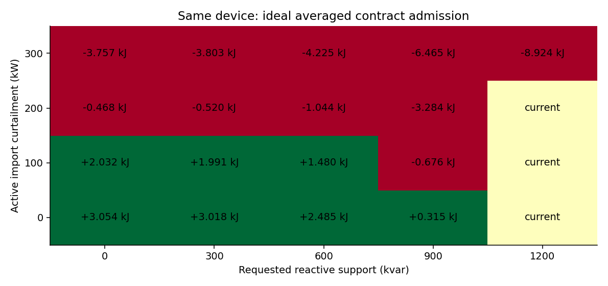
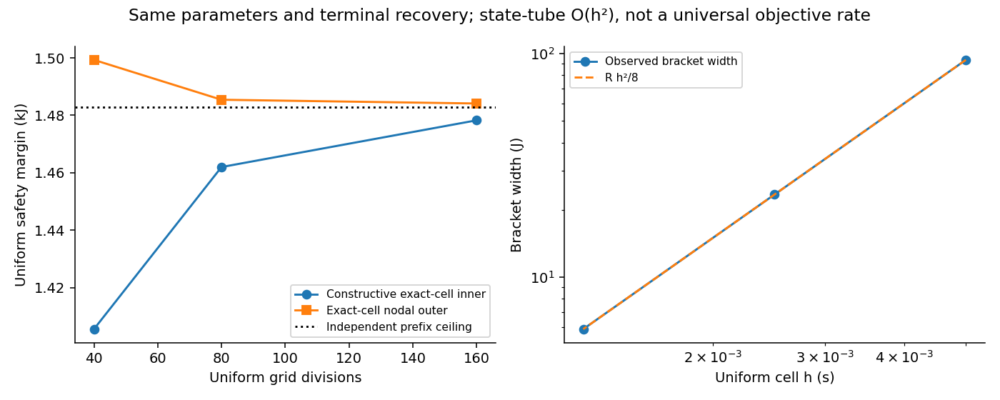
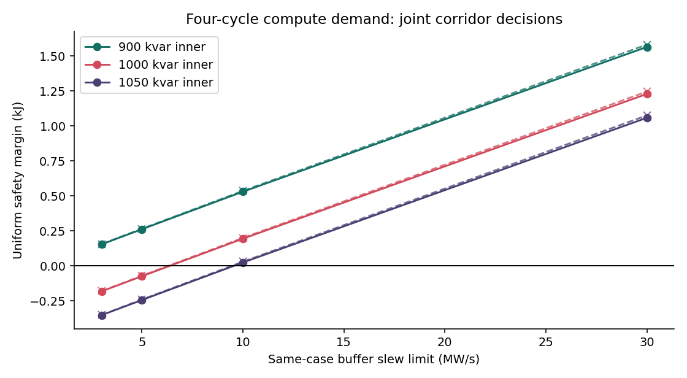
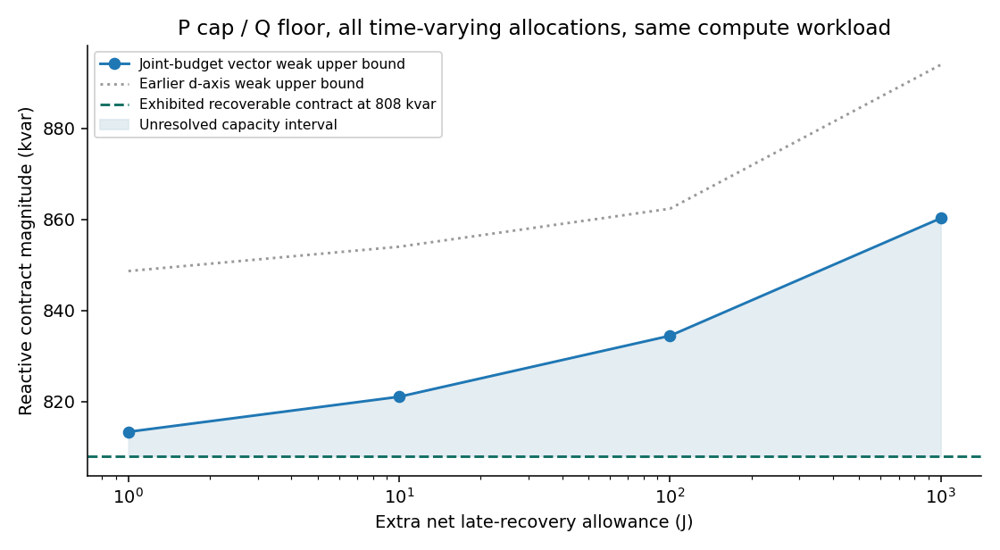

# G3：持续算力负荷的限流P/Q服务准入
## 精确端口走廊、全分配不可行证书与恢复合同

研究日期：2026-10-03 UTC。本报告为新建可再生模型研究，不是旧G3原始轨迹重播。

## 结论先行

本轮形成了一个可以独立写成“限定模型理论＋验证”的研究候选：在任务功率持续、计算工作不被丢弃的前提下，把AC电流、调制、电感/DC能量、受控缓冲端口、库存及恢复放在同一合同内，给出同参数不可行外界与可恢复内界。当前不能据此断言高原创性已经成立，更不能宣称真实GPU-PCC部署或开关系统精确恢复。

最重要的新增证据不是某个启发式控制器击败MPC，而是三个可以严格区分的结果：

1. 对指定P/Q轨迹，电气问题可精确化为一个随时间移动的缓冲电量走廊；保留滞后与爬坡的精确单元可达集，配合连续时间约束，给出可构造内界与控制器无关外界，以及显式O(h²)状态管误差
2. 对更有意义的P进口上限、Q最低支撑和全库存恢复合同，零能量余量产生轨迹刚性；正余量下使用能量预算与弱形式调制不等式，仍能排除所有允许的时变P/Q分配。固定轨迹排除没有被偷换成自由分配排除
3. 独立二电平三相PWM验证保住了所测有限窗硬安全和电池库存，却没有保住理想平均模型的精确DC/轨道恢复。这个失败被定量保存，不能用“电压看起来回来了”替代完整恢复

最清楚的自由分配结果：同一设备、同一100kW有功削减需求，在允许100J额外净恢复能量的P上限/Q下限合同中，已有808kvar完整可恢复平均模型见证；经独立复核的弱形式外界排除834.4146kvar及更高支撑，形成约3.27%宽的条件容量区间。这个区间是模型内结果，不是设备额定能力或实物分辨率。

另一个更强排除：200kW削减、Q最低值为0时，前35.5ms内即缺少约0.391kJ；即便乐观释放全部可用电感能量、允许任意更多的后段补能，也无法挽回已经发生的DC欠能量。

## 一、为什么重新开展G3，以及本轮没有沿用什么

历史G3的20ms/5MW·s⁻¹端口不可行证据与2ms/50MW·s⁻¹安全见证属于不同设备参数，不能组成同系统紧夹逼。旧健康参照本身持续guard活动，所以“退出全部限制”与回到该参照轨道不相容；但旧库存偏差和P/Q服务缺口仍然是真实的历史结果。

本轮只把历史材料作为问题与错误教训，不重写旧结论，不回填旧评分，不声称找回原始NPZ。新模型使用网侧进口正号、正的持续算力负荷和独立缓冲端口，不把旧BESS出口变量改名为计算负荷。

尝试过的路线也留下明确边界：总能量坐标的自由损耗SOCP松弛不是一般可行性等价，虚构耗散会制造DC上限余量或伪造恢复。该路线被反例约束后，转为精确固定路径走廊，再用能量合同桥接到自由分配。

## 二、冻结物理对象与四类合同

### 2.1 设备与符号

固定设备：690V线电压RMS、50Hz、每相L=0.3mH、R=5mΩ、DC电容30mF；Vdc初值1200V，硬界1080–1320V；相电流矢量峰值上限1500A。缓冲端口b和命令u均为±450kW，τ=5ms，主族爬坡±30MW/s，初始零命令继续保持1ms。电池库存初值50kJ、范围0–100kJ。没有把这些值称为厂商标定。

采用峰值dq变量，电流由电网流入整流器为正。ν=3/2、v=(V,0)：

- P=νVid≥0：网侧有功进口
- Q=νViq≥0：向电网提供的无功支撑；进口无功的符号是其相反数
- e=v−Ri−L i̇−ωLJi：整流器AC端电压
- Z=νL‖i‖²/2：滤波电感能量
- Ẇ=P−νR‖i‖²−Ż+b−d(t)，Ḃ=−b

d(t)>0是持续计算用电，b>0是缓冲向DC母线供电。初态、负荷、未来服务信息与动作权限对全部数值方法相同。

调制约束采用SVPWM线性六边形内切圆：‖e‖≤Vdc/√3。它不是普通无零序SPWM的Vdc/2上限。独立PWM同时报告圆形利用率和真实占空比跨度，不能靠六边形额外余量悄悄放宽理论约束。

### 2.2 持续工作与服务合同

主族计算负荷为650kW基线，加0–40ms的+300kW梯形脉冲和70–110ms的−300kW等能量脉冲；全程350–950kW，0.2s后继续650kW。没有停机、负荷丢弃或事后压缩工作。

网侧服务要求第一脉冲期间有功进口减少α，第二脉冲期间等面积偿还；Q为第一脉冲的β倍。125–175ms增加一个明确计价的有功补偿尾段γ，用精确能量方程计算铜损补偿。它不是隐瞒的额外免费资源。

四类判据分别为：

1. 硬安全：电流、调制、DC、库存、端口功率/命令/爬坡的全时间约束
2. 轨道恢复：i、W、b在T回到持续工作基线；本模型没有额外PLL/控制器积分状态，不能声称涵盖它们
3. 库存恢复：B(T)=B(0)
4. 服务交付：理想平均模型的指定P/Q；自由分配版本为P≤P上限、Q≥最低支撑。PWM仅报告实际跟踪误差，不把它称为精确服务

缓冲在1ms之后允许连续变化的命令u(t)，没有假装执行每拍ZOH、额外通信队列或未知负荷预测。PWM参考的采样控制误差另行验证。

## 三、核心数学结果及其量词

完整证明、反例和单元公式在 `theory/EXACT_PORT_CONTRACT_THEORY.md`。以下是可独立检查的命题主线。

### 3.1 精确电量走廊，只先用于指定P/Q轨迹

令C(t)=∫b，A(t)=∫(P−损耗−d)−Z(t)+Z(0)。则W=W0+A+C、B=B0−C。

令M(t)=‖e(t)‖²/κ²。原约束等价于

max{Wmin−W0−A，M−W0−A，B0−Bmax} ≤ C ≤ min{Wmax−W0−A，B0−Bmin}。

这是可逆的物理消元，不是允许额外损耗的松弛。当前路径确定后，P/Q、实际电流、调制电压及电感能量仍全部在走廊系数内。

### 3.2 同时保留lag与ramp的精确单元

在命令不变域[l,u]内，原饱和执行器的可行轨迹恰好满足

−Rd≤ḃ≤Ru，l≤b+τḃ≤u。

给定单元端点b0、b1和长度h，用最大前向响应与最小反向响应的交点得到逐点上包络；反向组合得到下包络。二者由线性爬坡段和指数lag段组成。对包络积分，得到精确电量区间[Imin(b0,b1),Imax(b0,b1)]。

任何中间电量都由上下包络轨迹的凸组合实现。拼接单元后b和C连续，初始保持命令及终端库存完全保存。Imax凹、Imin凸，因而支撑平面外逼近合法。纯lag情形有精确指数锥公式；有限爬坡不被谎称为纯SOCP。

简单的“端点爬坡＋积分lag”SOC条件只是必要界。证明中给出明确反例：它允许0.245单位电量，而实际lag/ramp单元最多0.2279690463。

### 3.3 连续时间内外夹逼与锐常数

对任一真实单元升力轨迹及物理约束松弛量f，若f″≤M，则

f(t) ≥ 端点弦线 − M h² x(1−x)/2 ≥ 最小端点松弛 − M h²/8。

因此：精确单元加未收紧节点约束是外界；相同单元加Mh²/8节点余量是可构造内界。两者使用完全相同设备、初态、队列、信息和恢复要求。1/8常数可由抛物线达到。

这里得到的是状态/能量管O(h²)，不是无条件的服务容量误差或计算复杂度定理。把状态误差转成准入值误差还需横截性/误差界。端点恰好触边时，对称收紧可能永远排除真实可行轨迹；报告保留这个反例，并给出弦线二次SOC的更细条件，没有声称全局内集稠密。

另一路独立内界：分段仿射电流/负荷＋分段二次b，使W、B和端口条件均为至多三次多项式。经典Markov–Lukács二乘二PSD表示可精确检查整个时间单元，避免只采样节点。它是成熟SOCP方法，不是本文发明的求解器。

### 3.4 不等式服务合同的刚性和稳定性

对于所有允许的连续P/Q分配，要求0≤P≤P̄<1/(2c)、Q≥Qmin≥0、同一负荷及共同初终总能量，其中c=R/(νV²)。令ε=∫[P̄−c(P̄²+Qmin²)−d]。

守恒给出精确恒等式：

ε=∫{(P̄−P)[1−c(P̄+P)]+c(Q²−Qmin²)}。

ε<0时全部分配不可恢复；ε=0时两项非负，迫使P=P̄、Q=Qmin。只有在这个明确的能量紧合同中，指定轨迹走廊才自动成为所有允许分配的等价准入。

ε>0时不再有这种刚性。由物理调制/电流得到δP=P̄−P的Lipschitz常数K，且端点δP=0，则幅度H满足

ε ≥ μH²/K + 2cH³/(3K)，μ=1−2cPmax>0。

因此允许偏离为O(√ε)，可能通过释放电感能量增加瞬时DC头寸。一个有严格电流/DC/调制余量的物理嵌入构造证明√ε阶不能一般改为O(ε)。这些插值阶及帐本等式本身都有经典先例，潜在新增在其物理约束下的准入作用。

### 3.5 正余量下对所有分配有效的弱调制排除

小幅P/Q偏离不意味着小导数，不能把指定路径的逐点调制下界直接转给自由分配。本轮改用紧支撑测试函数ψ，将电流导数分部积分：

∫ψ·e = ∫[ψ·v+(Lψ′−Dᵀψ)·i]，D=RI+ωLJ。

用同一个ε预算控制有功缺口和正Q最低支撑之上的偏离，再用同端口的最大电量、允许释放的电感能量和Wmax构成DC能量上包络。若弱电压需求的下界超过调制能力积分上界，全部允许分配均不可能。

这不是固定轨迹重新命名。实际P/Q可以任意时变，只要满足声明的P上限、Q下限、同设备、同负荷和恢复合同。选择测试函数只是寻找充分排除证书，不把未排除点宣布可行。

## 四、原始文献威胁与尚存的候选贡献

本轮核对25项原始来源，逐命题对照见 `literature/PRIMARY_NOVELTY_THREATS.md`、`FIXED_PATH_CERTIFICATE_ADDENDUM.md`。以下成分不应包装成新颖性：

- [Streitmatter等，2026](https://arxiv.org/html/2603.17135v1)：已有精确凸电流受限P/Q输出域，也适用于整流器
- [EasyRider，2026](https://arxiv.org/html/2604.15522v2)：已有计算负荷LC/主动缓冲、容量界、SoC恢复与滚动QP
- [Liu–Shin–Deka，2026](https://arxiv.org/html/2605.16190v1)：已有计算工作截止期、电池与电网进口协同优化
- [Evans–Tindemans–Angeli，2021/2022](https://arxiv.org/html/2110.08549v1)：已有可行服务集、能量约束与恢复保证
- [Guthrie–Mallada，2020](https://guthriejd1.github.io/files/ecc2020.pdf)：已有持续恒功率负荷、进口电流、周期端点、动态储能与锥规划
- [Johnson–Hauser，2012](https://motion.cs.illinois.edu/papers/ICRA2012-Johnson-optimal.pdf)：已有移动走廊中的极端轨迹与精确可达构造
- [TOPPRA](https://arxiv.org/html/1707.07239v2)、[Xia–Alizadeh，2015](https://optimization-online.org/wp-content/uploads/2015/06/4966.pdf)：O(h²)约束精度、三次区间SOCP均有成熟先例
- [Sz.-Nagy，卷10，1941–1943](https://acta.bibl.u-szeged.hu/13524/1/math_010_064-074.pdf)：Lipschitz积分到幅度的平方根/立方根和帐篷极值是经典不等式

有界检索未找到完整覆盖“lag/ramp电量单元＋实际调制/电感走廊＋终端恢复＋正余量下全分配弱证书”的同一定理，但这不是首次性证明。合理候选贡献是这一具体物理合同的量化必要/充分结果及有后果的判别，不是SOCP、MPC、能量坐标或AI标签。

## 五、数值证据与强基线

### 5.1 同信息方法

采用成熟全时域方法：精确单元可达/可控集、支撑平面LP、连续多项式SOCP、独立标量极端响应。全部读取相同完整初态、相同未来已声明波形和相同端口。没有给予候选更多预测或把MPC延迟人为放大；也没有把静态P/Q分配当作唯一基线。

本轮没有提出在线分配控制器，也没有实装在线MPC闭环竞赛。因此不声称比MPC更优或更快。求解时间仅为复现信息；理论结果不需要在相同真值最优问题上击败精确成熟方法。

### 5.2 20个主合同

α={0,100,200,300}kW、β={0,300,600,900,1200}kvar，分别使用40/80/160均匀分割并加入精确事件。7个唯一合同有完整安全与恢复见证；13个被排除，其中3个直接违反电流圆、10个由最大端口前缀和电气下界排除。三种网格是数值细化，不是60个独立实物样本。

α100、β600的160网格连续SOCP内界留有1.479836kJ统一余量；独立标量必要上界为1.4828898kJ。α100、β900的指定轨迹调制排除为−0.672553kJ；α200、β0的指定路径DC排除为−0.462325kJ。

这20个工况都能由简单极端前缀解释，因而不能证明精确单元方法的算法优势。独立审计发现一次原廉价SOCP外值比内值低约0.024J的浮点问题；该原值未被用作严格排除，改以独立解析排除和保存的LP加权不等式复核。

### 5.3 同参数内外收敛

α100、β600的精确单元节点外界和收紧构造内界如下。表中是浮点求解后的数值证据，数学保证见定理；没有宣称机器区间算术认证。

|均匀分割|内界余量kJ|外界余量kJ|宽度J|
|---:|---:|---:|---:|
|40|1.405553|1.499303|93.7500|
|80|1.461990|1.485427|23.4375|
|160|1.478262|1.484121|5.8594|

宽度在此活跃约束下恰按h²缩小；不把这个例子推广为所有服务边界的统一误差阶。

### 5.4 多周期算力形状迁移：联合约束确实增加判别

另一个事前冻结族保持同样电路，使用0.4s合同：650kW基线加80–240ms的四个40ms正弦周期，幅度500kW；用2.5ms折线样本定义准确波形。负荷150–1150kW，额外工作积分为零，之后继续650kW。Q为900/1000/1050kvar平台，端口爬坡为3/5/10/30MW/s；每一行内外比较参数完全相同。

12个合同中8个准入、4个排除。每个工况的独立全局最大/最小前缀筛查都还有至少4.104/4.536kJ余量，静态电流也没有排除它们。但联合走廊出现以下排除：

|爬坡MW/s|Q kvar|连续SOCP内值kJ|精确单元外值kJ|
|---:|---:|---:|---:|
|3|1000|−0.182221|−0.180589|
|3|1050|−0.352358|−0.350727|
|5|1000|−0.073990|−0.070510|
|5|1050|−0.244127|−0.240647|

负内值仅说明该优化没有找到非负余量；真正排除来自有效外界及其独立加权不等式。特别5MW/s、1000kvar还没有被全部网格节点有序三点曲率筛查排除，因而是保留联合lag/ramp/走廊的有后果例子。

8个正见证均经另写的SI abc平均方程回放，最大W差约3.02×10⁻⁸J，没有命令、爬坡或调制裁剪。坐标回放只是实现审计；后面的真实PWM才是新增物理层。

## 六、自由分配的容量区间与不确定区

零余量下，严格单调的能量恒等式把所有P上限/Q下限分配约束为边界轨迹。α100时的精确前缀外临界为约809.1293kvar；已有808kvar连续SOCP可恢复见证，最小余量约7.138J，810kvar被解析排除约6.363J。没有把临界等式点判为安全。

正余量族只扩大后段恢复P上限，使参考净能量恰多ε，早期P上限、Q最低支撑、负荷、初态和设备不变。已有808kvar见证仍是该放宽合同的可行点。向量弱测试在有限公开测试族中优化，严格复核的外界为：

|额外净恢复能量J|已展示可恢复支撑kvar|严格排除起点kvar|
|---:|---:|---:|
|0|808|809.1293以上的固定路径解析排除；向量弱界较松|
|1|808|813.3279|
|10|808|821.0297|
|100|808|834.4146|
|1000|808|860.2195|

这是最大可准入服务幅值的下/上界，不表示已经证明整段可行集合没有空洞。正余量区间内尚未分类的点保留为未知，没有将证书不活跃叫作可行。上端是容量上界而非一个孤立被排除点：在全分配的绝对Q电流上限1267.61094kvar以内，恢复尾峰仍小于100kW，固定测试的电压需求随β增加，误差预算不增加，能量上包络下降，所以排除余量严格单调；更高β直接被电流限制排除。

100J下区间[808,834.4146]宽26.4146kvar，约为下界的3.27%。100kW削减、900kvar最低支撑即使有这100J额外净恢复资源，仍对全部允许分配不可行。向量测试改善了原d轴测试的862.3137kvar外界；它是更强对偶证书，不是一个新控制器。

图同时展示向量界与先得到的d轴界；机器结果见 `theory/vector_weak_results.json`。所有测试函数、网格、角度、根、严格余量及独立积分均保留，不以优化调用次数增加样本量。

## 七、消融：哪些遗漏会改变科学判断

- 电感能量：α100、β810在完整模型下不能准入；只从能量账本删掉Z、却保留同一电感电压，会得到约+0.159kJ的伪安全余量。这个消融是故意不守恒的诊断，不是合法设备方案
- 初始响应延迟：同一β810工况删掉1ms保持延迟，内界改为约+0.399kJ；它说明毫秒级接口合同可改变结论，不能把延迟修改后的见证用来推翻原设备排除
- lag与ramp：α200、β0时，单独去掉延迟或lag仍分别约−0.0152/−0.0950kJ；增大100倍爬坡才得到约+1.029kJ。这些是分开改变的反事实，不把τ与R同时改变后归因给其中一个
- 调制：α100、β810去掉调制后内界约+1.732kJ；电流圆或DC硬下界不能替代真实电压可实现性
- 有限库存：α100、β600把B0改成10kJ且范围0–20kJ，余量降到约0.0222kJ；同初态只放松库存边界则回到约1.480kJ。B0为15或50kJ时该边界不活跃，照实保留无差异
- 终态恢复：去掉铜损補偿尾段，缺少0.133025kJ。要求DC与电池同时恢复时不可行；只要求DC恢复时电池少0.133025kJ；只要求电池恢复时DC少相同能量。两者都不要求时算法可把欠账藏在任一库存。先补偿好总能量后，仅删除B终态约束是数学冗余的无效消融，不能制造增益

消融全部数值、未成功求解情况、参数和正负判据见 `results/ABLATION_RESULTS.json`。负优化内值不是普适不可能，除非另有必要外证书。

## 八、独立三相开关验证：通过什么、没有通过什么

采用独立实现的二电平0/1桥臂、中心对齐PWM、实际abc RL动态、DC电容、正持续负荷和有限响应缓冲。使用冻结的10kHz采样/PWM与2000rad/s电流控制带宽；不是把dq矩阵换坐标就称为新物理。精确分段多项式u在节点跳变处按实际单侧值执行，没有把命令平滑化。

参考试验检查能量守恒、符号和开关频率收敛。41次原参考/主族/近界平均与开关运行保留，另对三条多周期形状见证做两步长检查。它们均为固定模型配置和数值细化，不是独立硬件样本。

主见证α100、β600：10kHz下Vdc约1136–1255V，电流峰约992A；库存恢复，但W(0.2)−W0约−12.00J，继续负荷到0.3s变成约−17.36J。独立能量分解闭合到3×10⁻⁸J，−12J主要由有功跟踪积分−12.144J造成，铜损相对理想略下降0.142J，数值能量残差约0.00255J。不能把12J说成积分误差。

四条事前冻结近界β790/800/805/808均未发生PWM、命令或爬坡裁剪。最紧β808的圆形调制利用率0.99976924，真实占空比跨度0.99953493；但其精确DC返回仍失败约11.91J。实际P/Q RMS误差被保留，不能称精确服务已迁移。

多周期最紧见证R10MW/s、Q1050kvar：电流峰1493.93783A，仅余6.06217A；Vmax1319.64110V，仅余0.35890V；圆形调制利用率0.99968502。有限窗硬界仍通过，库存恢复到微焦量级，DC在0.4s仍欠约21.29J，到0.5s欠约26.78J。这个持续偏差禁止无限期轨道恢复宣称。

结论必须分栏：

|对象|有限窗硬安全|电池库存恢复|精确DC/电气轨道恢复|精确P/Q交付|
|---|---|---|---|---|
|声明的理想平均模型见证|已构造并独审|已构造|已构造|已构造|
|冻结10kHz开关控制验证|所测窗口通过|数值恢复|未通过|未通过，误差有量化|
|真实设备/数据中心|未验证|未验证|未验证|未验证|

不存在新增现场数据、GPU到PCC同步真值或实机资格。缺少这些数据不否定限定模型定理，但阻止相应现实外推。

## 九、科学判断与合理停止点

### 已建立

- 物理一致、符号明确、持续工作固定的新模型
- 指定路径精确走廊及可达单元，连续时间内外结构及显式状态管界
- 自由分配合同的零余量等价桥接、正余量DC/弱调制排除
- 同参数严格余量可行/不可行判别；联合走廊新增决策例子
- 独立平均和真实PWM模型检查，连同精确恢复未迁移的反例
- 端口、电感、调制、库存与恢复的有信息消融

### 没有建立

- 原问题所有自由P/Q、任务可重排、未知负荷、任意网压扰动下的完整最优控制解
- 对所有边界的统一O(h²)容量误差、全局新复杂度定理、实时100μs能力
- 新控制器优于成熟MPC、适用于全部储能拓扑的端口参数
- 开关/不平衡/实际设施精确恢复、真实部署收益、高原创性或高影响录用资格

25项近邻原始工作已经占据大部分单独工具；完整组合是否有足够定理级差异仍需面向最接近工作的逐条排重。合理的下一步是将“正余量全分配弱证书＋精确恢复可达单元”组织成窄命题稿件，交由领域专家审查其差异；不是继续扩大参数网格直到出现好看的控制器胜负。

本轮能够以完整模型理论候选收束。若近邻文献已经包含同等量词、同等端口与物理约束、同阶且同样可构造的边界，创新表述应降级为可复核应用/基准。若只缺实物或没有击败精确MPC，则不构成否定本理论路线的理由。

## 十、复现入口与证据限制

- 主模型和成熟锥规划：`src/model.py`、`src/admission.py`
- 精确lag/ramp单元：`theory/exact_cell.py`
- 精确单元支撑LP：`src/exact_outer.py`
- 主族、消融、形状族：`src/run_campaign.py`、`run_ablations.py`、`run_switch_corridor.py`
- 自由分配证书：`theory/dc_allocation_certificate.py`、`weak_modulation_certificate.py`、`vector_weak_certificate.py`
- 全数学证明：`theory/EXACT_PORT_CONTRACT_THEORY.md`
- 独立方程、加权LP、自由分配和形状审计：`audit/`
- 真正开关模型、参考、主族、近界和形状验证：`validation/`
- 冻结方案与所有结果：根目录协议JSON及`results/`

所有科学代码和结果均新建于本G3目录。旧研究、G2及原相位稿未改。数值外证书采用浮点支撑平面和高精度重组，不是形式化区间算术证明。原始理论和明确余量、独立方程验证共同支持这里限定的数值结论。
